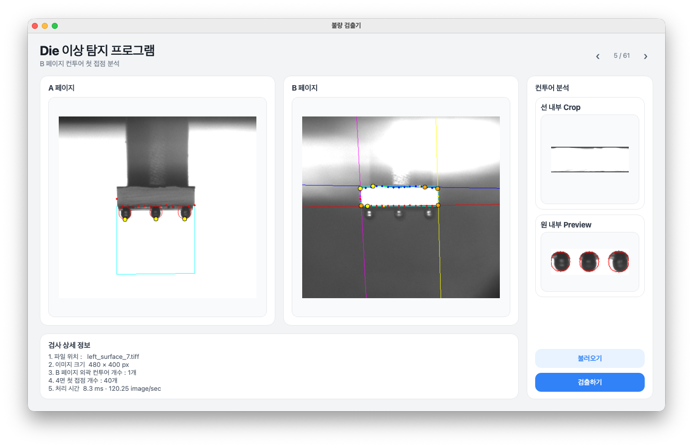

# Die Surface Contour Inspector

> An OpenCV-based program designed to swiftly detect defects on the top, bottom, left, and right plates of a die surface.



## Current Feature
#### Side Surface
1. Processed the side images using brightness binarization and contouring, generating vertical search lines based on the initial contact points from the image edges to the surface.
     - To prevent errors caused by a slight rotation of the side, the surface was divided into ‭$N$‬ segments to accurately identify the contact points.
2. For the side balls, a bottom surface ROI is created to find the first contact points. Three points are selected where each is at least 60 pixels apart horizontally and 20 pixels away from the tangent line, and circles are drawn based on a diameter length.

#### Top-Bottom Surface
1. Detect the contour on B page and project its dotted bottom contact points to
   the identical surface position on A page.
2. Search a 150px ROI below the bottom tangent from bottom to top, then select
   up to three first-contact points at least 60px apart and 40px below the
   tangent.
3. Draw a circle whose diameter is the distance between each selected contact
   point and the bottom tangent.
4. Keep the surface Crop preview and show only the pixels inside the red
   circles in a separate sidebar preview.


## Project Structure

```text

├── app.py             # Starts the PyQt5 application
├── ui.py              # Displays A- and B-page results together 
├── contour.py         # B-page contour 
├── styles.py          # UI styles (created by Claude)
├── requirements.txt   # Python dependencies
├── assets/            # Application icon and other assets
└── dataset/            

```

## Requirements

- Python 3.10–3.12 recommended
- Input `TIFF` images must contain A/B pages with identical dimensions (specific Dataset)

## Installation

Run the following commands after receiving the project.

### macOS / Linux

```bash
cd diehand_cv
python3 -m venv .venv
source .venv/bin/activate
python -m pip install --upgrade pip
python -m pip install -r requirements.txt
```

### Windows PowerShell

```powershell
cd diehand_cv
py -m venv .venv
.\.venv\Scripts\Activate.ps1
python -m pip install --upgrade pip
python -m pip install -r requirements.txt
```

## 실행

```bash
python app.py
```

> Note: Since this repository is a program designed for specific experimental research, it may not be suitable for your project.
